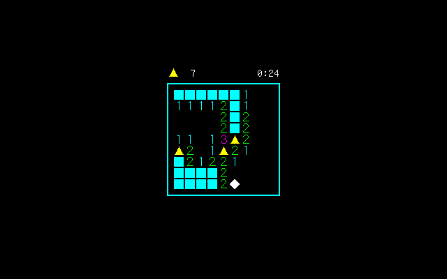
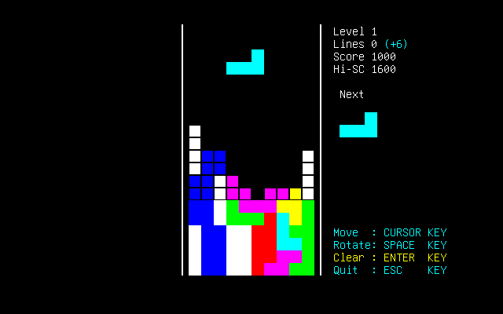

# [cons サンプルゲーム](https://github.com/tenk-a/cons)

ncurses / [pdcurses](https://pdcurses.org/) (windows,mac,linux)、および pcat,pc98 dosコンソール を用いた TUI のサンプル・ゲーム２種。

複数ターゲット向けのビルドを CMAKE_TOOLCHAIN_FILE を用いた cmake で行う、  
以下に書いたネタのサンプルの延長。

- [curses サンプルと PDCurses のビルド](https://zenn.dev/tenka/articles/building_pdcurses)
- [toolchain利用cmakeでdos,win,mac,linux向ビルド](https://zenn.dev/tenka/articles/building_with_cmake_toolchain_file)
- [curses を使ったサンプルゲーム](https://zenn.dev/tenka/articles/samplegame_using_curses)

使用コンパイラ:  
xcode、linux(gcc)、vc、[watcom](https://github.com/open-watcom/open-watcom-v2)、[msys2](https://www.msys2.org/)、[djgpp](https://github.com/andrewwutw/build-djgpp)、[ia16-elf-exe](https://launchpad.net/~tkchia/+archive/ubuntu/build-ia16)

## mines



普通のマインスイーパー。

```
移動         : CURSORキー | w s a d  
オープン     : SPACEキー  | z  
フラグon/off : ENTERキー  | x  
強制終了     : ESCキー    | c  
```

## otitame



テトリスの変種（パチモン）。
行を揃えてもすぐには消えず、ENTERキーで連なった行を纏めて消す仕様。  
<!-- 揃えた時に 行数x行数x100、クリアした時に (1+2+..+n)x100、点が入る。 -->

```
移動         : ← ↓ → キー | a s d  
回転         : SPACEキー  | z  
貯め行クリア : ENTERキー  | x
強制終了     : ESCキー    | c  
```


## ビルド

<!-- まずコンパイラへのパスを通す。> コンパイラごとのプロンプトを使う設定方法でも、この環境で用意している setcc.bat を使うでも。 -->

bld/ フォルダにて

```batch
bld.bat [ツールチェイン名]
bld.sh  [ツールチェイン名]
```

を実行で、bin/[ツールチェイン名]/*.exe を生成。

ツールチェイン名は、コンパイラやターゲット環境を元にして

【ncurses使用】  
　mac  
　linux  
  
【pdcurses使用】  
　vc-win64 　 vc-win64-md 　 vc-win32 　 vc-win32-md  
　(vc-winarm64 　 vc-winarm 　 ※実行未確認)  
　mingw-win64 　 mingw-win32  
　djgpp-dos32  
　watcom-win32 　 watcom-dos32 　 watcom-dos16-s  
  
【ターゲット・コンソールVRAM直書】  
　ia16-pcat-dos16-s  
　watcom-pcat-dos16-s 　 watcom-pcat-dos32  
　watcom-pc98-dos16-s


フォルダやファイルが変わっているが、この環境のビルドの仕組みや、ncurses / pdcurses 向けのツールチェインの説明等は、以下を。  
　[toolchain利用cmakeでdos,win,mac,linux向ビルド](https://zenn.dev/tenka/articles/building_with_cmake_toolchain_file)

## ncurses、pdcurses での UNICODE 版

現状 vc と mingw は UNICODE 文字を使う設定。  
Windows10,11 で Windows Terminal で実行を。現在の Windows11 なら Windows terminal が標準のはず。

Windows10 のコマンドプロンプトでは全角表示が半分で表示されたり等問題が多く。  
また、Windows8 やそれ以前の UNICODE(CP 65001)コンソールは全て等幅表示で、半角全角前提の今回のプログラムには適さず、で。

> UNICODEでの半角・全角の扱いはいろいろ面倒あり。  
基本 UNICODE 規定の半角・全角に関わるルールの結果のようだが、これが曲者。  
CJK文字とか、明確に全角と規定されている文字は全角であつかわれるが、記号関係はカオス。  
JIS由来の文字で等幅前提で考えられて組み合わせて使うような記号や罫線が、半角・全角・プロポーショナル処理が入り乱れた、非常に残念な表示になってしまう。  
<!-- ゲームで組み合わせて使えそうなセミグラフィック・フォントが、表示してみると文字ごとにサイズやプロポーショナル処理が違って並べても繋がらない無惨な結果でほんと無念。 -->

## PC98 DOS

```
bld.bat watcom-pc98-dos16-s
```

PC98 DOS 版は、80x25 のテキストVRAM直書で、16bit dos のみ。  
Open Watcom は v2.0 beta で PC98 対応がいろいろ入っているようなので、ビルドでは v2.0beta を使用。

動作は主に [dosbox-x](https://dosbox-x.com/) の PC98 モードで、たまに [t98next](https://akiyuki.boy.jp/t98next/),[Neko Project 21/W](https://simk98.github.io/np21w/), 実機(PC-386M) で確認。

※ watcom-pc98-dos32 で一応 PC98 の dos4gw 版 exe を生成できるが、dosbox-x 以外ではハングで実行できず。(dosbox-x も処理落ち激しく)  
dosbox-x で dos32版を試す場合は、dos4gw.exe をPATHの通った場所に置き、環境変数
```
set DOS16M=1
```
で dos4gw をpc98モードに設定したのち、exe 実行。


## PC-AT DOS

```
watcom-dos16-s  watcom-pcat-dos16-s  ia16-pcat-dos16-s  
watcom-dos32    watcom-pcat-dos32    djgpp-dos32  
```

watcom と djgpp は windows 上でビルド、ia16-elf-exe 用は ubuntu 22.04 上でビルド。

動作は dosbox-x で確認。(16bit dos については [msdos player](http://takeda-toshiya.my.coocan.jp/msdos/) でも可)

watcom-dos16-s と watcom-dos32 は pdcurses を用いたもので、他は PC(AT) のテキストVRAMに直接書込むもの。  

テキストVRAM直書版は Code Page 437 を使うので、exe実行前に chcp 437 をしておく。  

>[Watcom C/C++ cmakeメモ](https://zenn.dev/tenka/articles/using_cmake_with_watcom)  
[djgpp windowsクロスコンパイラ・メモ](https://zenn.dev/tenka/articles/using_djgpp_on_windows)  
[ia16-elf-gcc メモ](https://zenn.dev/tenka/articles/use_ia16_elf_gcc) [cmake メモ](http://zenn.dev/tenka/articles/using_cmake_with_ia16elfgcc)

