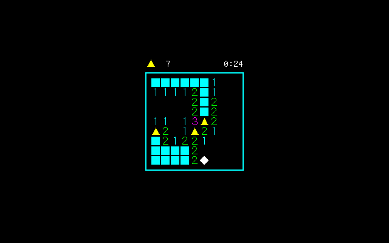
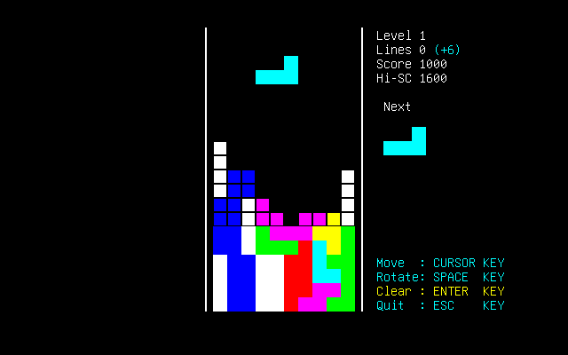
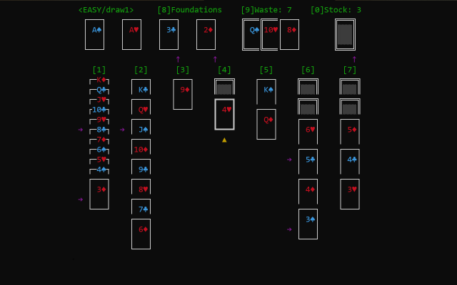

# [cons サンプルゲーム](https://github.com/tenk-a/cons)

ncurses / [pdcurses](https://pdcurses.org/) (windows,mac,linux)、および pcat,pc98 dosコンソール を用いた TUI のサンプル・ゲーム３種。

複数ターゲット向けのビルドを CMAKE_TOOLCHAIN_FILE を用いた cmake で行う、
以下に書いたネタのサンプルの延長。

- [curses サンプルと PDCurses のビルド](https://zenn.dev/tenka/articles/building_pdcurses)
- [toolchain利用cmakeでdos,win,mac,linux向ビルド](https://zenn.dev/tenka/articles/building_with_cmake_toolchain_file)
- [curses を使ったサンプルゲーム](https://zenn.dev/tenka/articles/samplegame_using_curses)

使用コンパイラ:
xcode、linux(gcc)、vc、[watcom](https://github.com/open-watcom/open-watcom-v2)、[msys2](https://www.msys2.org/)、[djgpp](https://github.com/jwt27/build-gcc)、[ia16-elf-exe](https://launchpad.net/~tkchia/+archive/ubuntu/build-ia16)

## mines



普通のマインスイーパー。

```
移動         : CURSORキー | w s a d
オープン     : SPACEキー  | z
フラグon/off : ENTERキー  | x
強制終了     : ESCキー    | c
```

## otitame



テトリスの変種（パチモン）。
行を揃えてもすぐには消えず、ENTERキーで連なった行を纏めて消す仕様。
<!-- 揃えた時に 行数x行数x100、クリアした時に (1+2+..+n)x100、点が入る。 -->

```
移動         : ← ↓ → キー | a s d
回転         : SPACEキー  | z
貯め行クリア : ENTERキー  | x
強制終了     : ESCキー    | c
```

## Klondike



トランプのソリティア/クロンダイク.


## ビルド

利用するコンパイラのパスをあらかじめ通しておいて。
<!-- コンパイラごとのプロンプトを使う設定方法でも、この環境で用意している setcc.bat を使うでも。 -->

windows 環境では thirdpary/ にターゲット用の pdcurses ライブラリがなければそれを install_pdcurses.bat でビルド。linux や mac は ncurses がある前提。

Generator と CMAKE_TOOLCHAIN_FILE を指定して cmake を使う。

たとえば、

```batch
:: vc14.3(2022) win64 用.
cmake -G "Visual Studio 17 2022" -A x64 -DCMAKE_TOOLCHAIN_FILE=toolchain/vc-win64-toolchain.cmake -B bld/vc-win64 .
cmake --build bld/vc-win64
cmake --install -B bld/vc-win64

:: Watcom C 32bit dos 用
cmake -G "Watcom WMake" -DCMAKE_TOOLCHAIN_FILE=toolchain/watcom-dos32-toolchain.cmake -B bld/watcom-dos32 .
cmake --build bld/watcom-dos32
cmake --install -B bld/watcom-dos32
```

ただ、コンパイラ(のバージョン)にあわせて Generator 選んだりツールチェイン指定が長かったりなので、

```batch
bld\bld.bat [ツールチェイン名]
bld/bld.sh  [ツールチェイン名]
```

で簡略化。
win版は必要に応じて PDCurses をビルドし、bin/[ツールチェイン名]/*.exe を生成する。

ツールチェイン名は、コンパイラやターゲット環境を元にして

```
【ncurses使用】
　mac
　linux

【pdcurses使用】
　vc-win64 　 vc-win64-md 　 vc-win32 　 vc-win32-md
　(vc-winarm64 　 vc-winarm 　 ※実行未確認)
　mingw-win64 　 mingw-win32
　djgpp-dos32
　watcom-win32 　 watcom-dos32 　 watcom-dos16-s

【ターゲット・コンソールVRAM直書orBIOS】
　djgpp-dosv-dos32
　watcom-pc98-dos16-s　watcom-pc98-dos16-l 　 watcom-pc98-dos32
　watcom-dosv-dos16-s　watcom-dosv-dos16-l 　 watcom-dosv-dos32
　watcom-pcat-dos16-s　watcom-pcat-dos16-l 　 watcom-pcat-dos32
　ia16-pcat-dos16-sl 　ia16-dosv-dos16-sl

```

を用意。

ツールチェイン名を省略した場合は、PATH で見つかるコンパイラの win 版が選択される。

また、
```batch
bld.bat list
```
で、ツールチェイン一覧表示。

あと。
all_bld.bat は、一度に複数のコンパイラでビルドするバッチ。自分の環境に合わせて、書き換える前提。
setcc.bat は コマンドプロンプト用の各コンパイラの設定を行うバッチ。これも、自分の環境に合わせて、書き換える前提。

※ なお、現状とは多少違うが大筋の、この環境のビルドの仕組みや、ncurses / pdcurses 向けのツールチェインの説明等は、以下を。

　[toolchain利用cmakeでdos,win,mac,linux向ビルド](https://zenn.dev/tenka/articles/building_with_cmake_toolchain_file)

## ncurses、pdcurses での UNICODE 版

現状 vc と mingw は UNICODE 文字を使う設定。

Windows10,11 で Windows Terminal で実行を。現在の Windows11 なら Windows terminal が標準のはず。
Windows10 のコマンドプロンプトでは全角表示が半分で表示されたり等問題が多く。

また、Windows8 やそれ以前の UNICODE(CP 65001)コンソールは全て等幅表示で、半角全角前提の今回のプログラムには適さず、で。

> UNICODEでの半角・全角の扱いはいろいろ面倒あり。
基本 UNICODE 規定の半角・全角に関わるルールの結果のようだが、これが曲者。
CJK文字とか、明確に全角と規定されている文字は全角であつかわれるが、記号関係はカオス。
JIS由来の文字で等幅前提で考えられて組み合わせて使うような記号や罫線が、半角・全角・プロポーショナル処理が入り乱れた、非常に残念な表示になってしまう。
<!-- ゲームで組み合わせて使えそうなセミグラフィック・フォントが、表示してみると文字ごとにサイズやプロポーショナル処理が違って並べても繋がらない無惨な結果でほんと無念。 -->

## PC-AT DOS

```
watcom-dos16-s   watcom-pcat-dos16-s
watcom-dos16-l   watcom-pcat-dos16-l
watcom-dos32     watcom-pcat-dos32
djgpp-dos32      ia16-pcat-dos16-s
```

watcom と djgpp は windows 上でビルド、ia16-elf-exe 用は WSL の ubuntu 24.04 (22.04) 上でビルド。

動作は dosbox-x でのみ確認(実機未確認)。(16bit dos については [msdos player](http://takeda-toshiya.my.coocan.jp/msdos/) で動く可能性あり)

watcom-dos16-s と watcom-dos32 は pdcurses を用いたもので、他は PC(AT) のテキストVRAMに直接書込むもの。

テキストVRAM直書版は Code Page 437 を使うので、exe実行前に chcp 437 をしておく。

>[Watcom C/C++ cmakeメモ](https://zenn.dev/tenka/articles/using_cmake_with_watcom)
>[djgpp windowsクロスコンパイラ・メモ](https://zenn.dev/tenka/articles/using_djgpp_on_windows)
>[ia16-elf-gcc メモ](https://zenn.dev/tenka/articles/use_ia16_elf_gcc) [cmake メモ](http://zenn.dev/tenka/articles/using_cmake_with_ia16elfgcc)

Klondike は c++ で大きめで、コンパイラによって DOS small モデルではコンパイル通せなかったり動作不安定だったりするので、そういう場合はビルドせず。

dos 用 watcom や djgpp の cmake はタイミングによって、初回生成ビルドを失敗することがあるが、2回目をすると通るかも。

djgpp は [build-gcc](https://github.com/jwt27/build-gcc) で生成した i386-pc-msdosdjgpp なものを想定。
[build-djgpp](https://github.com/andrewwutw/build-djgpp) で生成した i586-pc-msdosdjgpp を使う場合は djgpp*-toolchain.cmake を修正のこと。

ia16-elf-gcc には、以前の公式ubuntu22.4配布には i86.h dos.h が含まれていたが、今は含まれなくなったようなので、とりあえず必要な互換関数を用意して対応している。


## DOS/V

```
watcom-dosv-dos16-s watcom-dosv-dos16-l
watcom-dosv-dos32   djgpp-dosv-dos32
ia16-dosv-dos16-s
```

動作は dosbox-x の dos/v on/off 環境でのみ確認(実機未確認)。
CP932 前提。
PC/AT版の改造版的なもので、PC/AT側の説明も参照のこと。

dosbox-x は dos/v オフでも、ax系?が考慮されてるのか CP932 だとSJISを表示できる模様。

DOS/V on では可能なら仮想テキストバッファへ直書、それ以外なら BIOS(int 10h ax=1302h)使用。

32bit環境で DOS/V コール使うのはいろいろ罠ある...


## PC98 DOS

```
watcom-pc98-dos16-s  watcom-pc98-dos16-l
watcom-pc98-dos32    djgpp-pc98-dos32
```

PC98 DOS 版は、80x25(30) のテキストVRAM直書で、watcom の 16bit dos と dos4gw、djgpp の cwsdpmi 環境。
Open Watcom は v2.0 beta で PC98 対応がいろいろ入っているようなので、ビルドでは v2.0beta を使用。
djgpp pc98 は一応動作していそう。

動作は主に [dosbox-x](https://dosbox-x.com/) の PC98 モードで、たまに [Neko Project 21/W](https://simk98.github.io/np21w/), <!-- [t98next](https://akiyuki.boy.jp/t98next/),--> 実機(PC-386M) で確認。
※ dosbox-x は最近(2025)のモノを使用。古いと32bitプログラムは不安定かも。

watcom dos32版を試す場合は、dos4gw.exe をPATHの通った場所に置き、環境変数
```
set DOS16M=1
```

で dos4gw をpc98モードに設定したのち、exe 実行。

djgpp 版のビルドは [build-gcc](https://github.com/jwt27/build-gcc) で作った djgpp-2.05 gcc 14.2 に、[djgpp-cvs.nec](https://github.com/lpproj/djgpp-cvs.nec/releases) の nec98-test-20231121 のライブラリ＆ヘッダを該当フォルダに上書きした環境で作成。

実行には PC98対応の CWSDPMI が必要で、[CWSDPMI r7のPC-98対応状況をすこし改善するパッチ](https://gist.github.com/lpproj/d4220ba47d01998e4d011bdb7bf076b7) から csdpmi7b_pc98fix_20230326.zip の pc98x1対応cwsdpmi を、サンプルをコンパイルしたexeと同じフォルダにおく、または
```
set CWSDPMI=c:\cwsdpm98\cwsdpmi.exe
```
のように 環境変数に cwsdpmi.exe のフルパスを設定しておき、exe実行。

※djgpp版は vsync コールバックうまくいかず.

